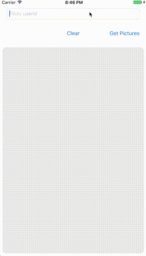

# FlickStream
Simple Flickr Client

##Thoughts on process
I made a few more commits than I normally would so that everyone could see my process of 
1. make it work 
2. make it work better
3. make it look better

I cut a few corners in places to just get something going, and decided to get into custom constructors for my response objects instead of just doing some hacky jason parsing inside the return block.

If you try to build it, make sure you follow the install instructions below. and get your own apikey 😊

I’ve traditionally done my UI using code instead of IB, but teaching IB has made me really appreciate it and how much time it can save for prototyping and hitting multiple devices. No idea if you are a IB shop or a code only shop.

I didn’t get to unit tests, but I can go back and do some if you’d like.

After I got the images downloading into cells, I decided to pod up SDWebImage to give me caching and asynch downloading to improve the scroll performance. I didn't use ObjectiveFlickr because I felt like you wanted to see my code, hopefully I struck a good balance. I also chose not to include the Pods in the repo to force you to run pod install and add the Secrets.swift file. 

##Install instructions: 
Secrets.swift has been added to the .gitignore in order to hide the flickr apikey. Impliment your own  `class func apikey() -> (String)` in order to build. also requires a `pod install`

